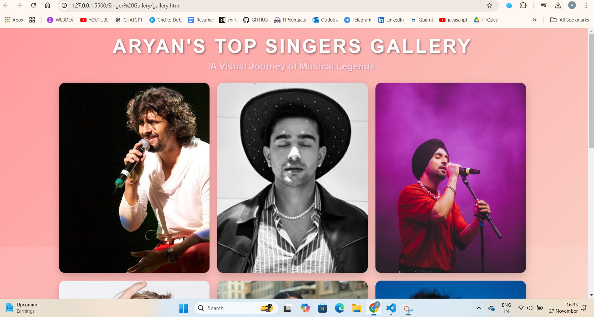
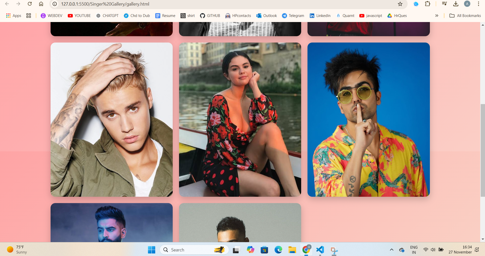
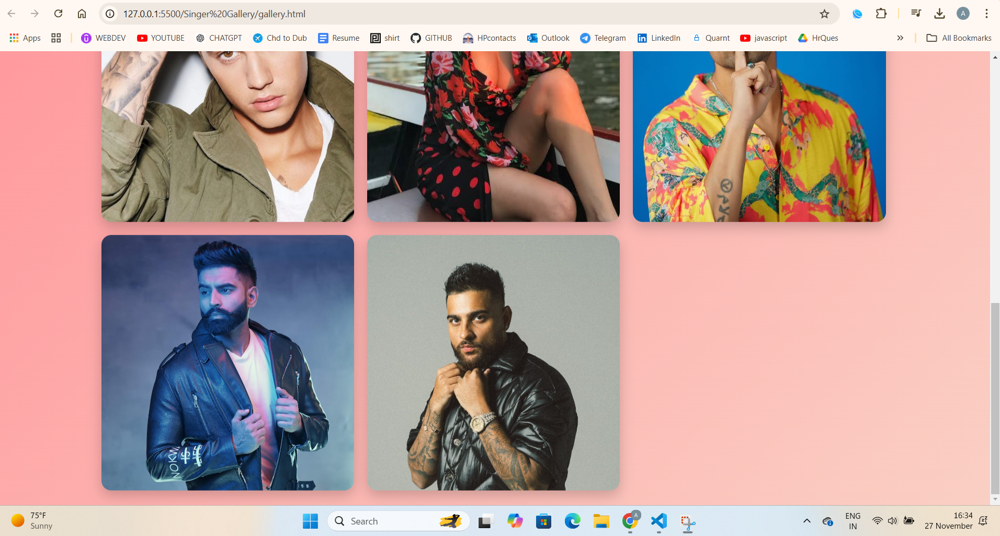

🎨 Dynamic 3D Image Gallery 🖼️

✨ A modern, responsive, and interactive image gallery featuring dynamic slideshows, 3D effects, hover sounds, and a seamless design.

## 🎨 **Preview**

### 📷 **Gallery View**

🌟 Key Features
🖱️ 3D Interactive Tilt Effect: The gallery moves dynamically based on mouse movement.

🎞️ Image Slideshow: Images auto-switch on hover for each gallery box.

🔊 Hover Sounds: Custom audio triggers when you hover over a gallery box.

🌈 Gradient Background: Aesthetic linear gradient for a beautiful backdrop.

📱 Responsive Design: Optimized for desktop, tablet, and mobile devices.

🖼️ Favicon: A custom favicon to complete the professional touch.

🛠️ Technologies Used
HTML5: Structuring the content.
CSS3: Styling and animations.
JavaScript (Vanilla): Interactivity and functionality.

🚀 Setup Instructions
Follow these steps to set up the project locally:

Clone the Repository:
git clone https://github.com/aryan-ksp/Singer-Gallery.git

Navigate to the Project Directory:
cd Singer-Gallery

Open the Project:
Open gallery.html in your browser to view the project.

How to Add Images
Place your images in the images/ folder.

Customizing Favicon
Replace favicon.ico or favicon.png in the project directory with your custom icon.
Update the <link> in the index.html file if needed:
<link rel="icon" href="path-to-your-favicon/favicon.ico" type="image/x-icon">

🤝 Contributing
Contributions are welcome!

Fork the repository.
Create a new branch for your feature/bug fix:
git checkout -b feature-name
Commit your changes and submit a pull request.

🎉 Let's Connect
🌐 Linkedin:- https://www.linkedin.com/in/arynksp/ | 📧 Email:-aryn.ksp@gmail.com

